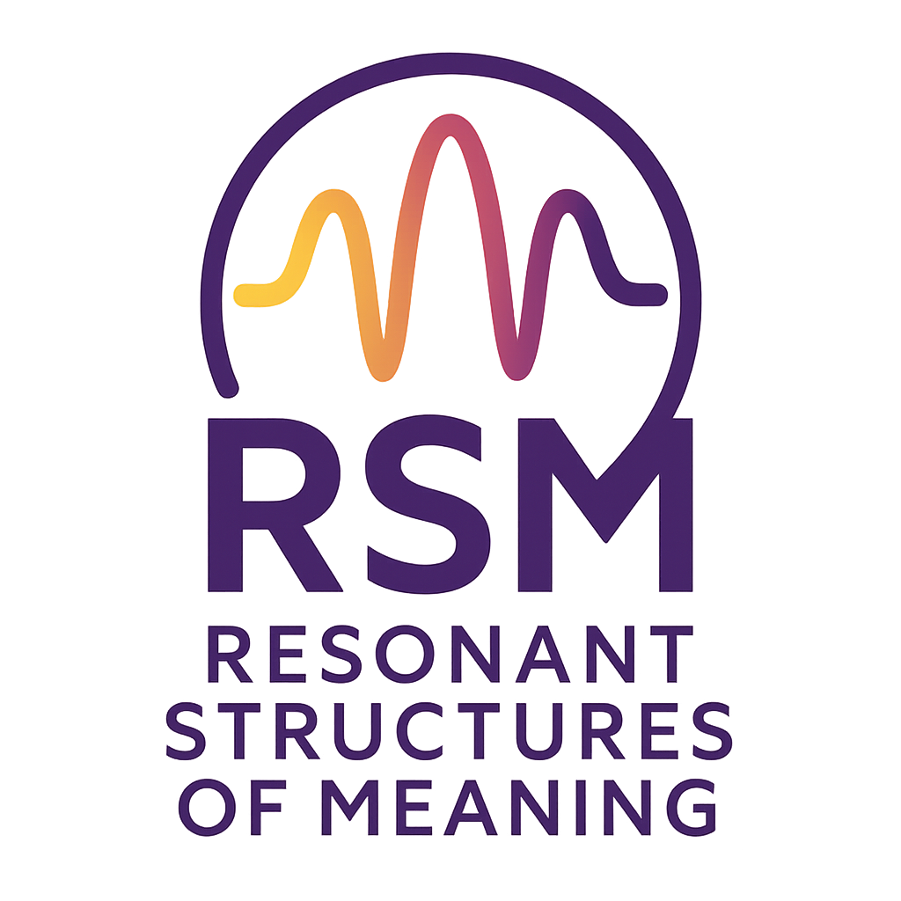
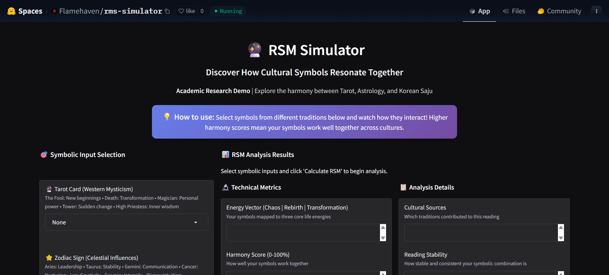
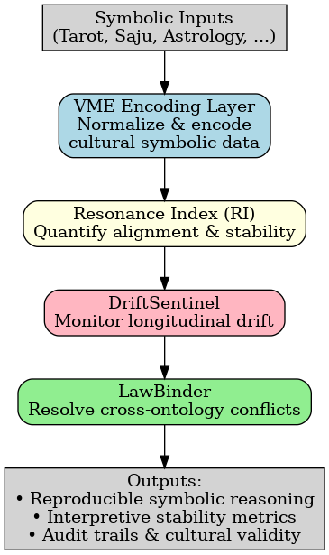

# Resonant Structures of Meaning (RSM)

<p align="center">
  
</p>

<p align="center">
  <strong>Executable ontology bridging cultural meaning and computational reproducibility.</strong>
</p>

<p align="center">
  <a href="https://huggingface.co/spaces/Flamehaven/rsm-simulator" target="_blank"></a>
  <a href="https://colab.research.google.com/" target="_blank"></a>
  
  
</p>

> 🔮 *From cultural symbols to reproducible computation — bridging meaning with code.*

---

## 📜 Research Paper & Abstract

This repository contains the complete source code, data, and validation harnesses for the research paper, "Resonant Structures of Meaning: A Machine-Executable Ontology for Interpretive AI."


**Abstract:** This paper introduces Resonant Structures of Meaning (RSM), a machine-executable ontology for symbolic and interpretive AI. Unlike conventional pipelines that begin with theoretical frameworks and only later attempt code translation, RSM adopts a **code-first methodology**: executable systems serve as primary research artifacts from which theoretical insights and methodological structures are derived. 

---

## 🎮 Live Demo & Showcase

👉 [**Live Demo on Hugging Face Spaces**](https://huggingface.co/spaces/Flamehaven/rsm-simulator)  
*Run RSM in your browser — no installation required!* 



---

## ✨ Key Features

- ⚡ **VME (Vector of Meaning Energy)** – Encodes cultural symbols into normalized, machine-readable vectors.
- 🎼 **RI (Resonance Index)** – Quantifies interpretive alignment and harmony between symbols.
- 🛰️ **DriftSentinel** – Monitors the stability of symbolic meanings over time.
- ⚖️ **LawBinder** – Provides a framework for resolving conflicts between different symbolic systems.

<p align="center">
  
</p>

---

## ⚙️ In-Depth Concepts

<details>
<summary><b>Click to expand: The 4 Core Mechanisms</b></summary>

- **VME (Vector of Meaning Energy)**
  - *What it is:* A normalized vector encoding that represents symbolic data from diverse cultural systems (e.g., Tarot, Saju, Astrology) in a unified mathematical space.
  - *Its function:* Translates abstract cultural symbols into concrete, machine-readable data.

- **RI (Resonance Index)**
  - *What it is:* A quantitative metric (0.0 to 1.0) that measures the degree of interpretive alignment and harmony between a set of symbolic vectors.
  - *Its function:* Provides an objective score for how well different symbols "work together."

- **DriftSentinel**
  - *What it is:* A monitoring module that tracks the stability of the Resonance Index (RI) over time or across different contexts.
  - *Its function:* Detects and alerts on "interpretive drift," ensuring that meanings remain consistent and reproducible.

- **LawBinder**
  - *What it is:* A conflict-resolution framework that applies explicit strategies (e.g., harmonize, prioritize) when aggregating vectors from multiple ontologies.
  - *Its function:* Manages disagreement and maintains coherence when combining different systems of meaning.

</details>

<details>
<summary><b>Click to expand: Project Philosophy & Structure</b></summary>

**Philosophy:** RSM addresses fundamental reproducibility challenges in interpretive AI by grounding symbolic reasoning in executable, auditable artifacts. By treating code as the primary ontology, it inverts the traditional "theory-first" pipeline, thereby minimizing the gap between conceptual design and computational implementation.

**File & Directory Guide:**
```
.
├── engine/          # Core computational engines (VME, RI, DriftSentinel)
├── data/            # Symbolic databases in JSON format
├── tests/           # The full validation test suite (>100 tests)
├── paper/           # The academic research paper (PDF)
├── docs/            # Documentation and images
│   └── images/
├── huggingface_deployment/ # Self-contained code for the HF Spaces demo
├── rsm_simulator.py # Main interactive simulator (local execution)
└── README.md        # You are here!
```

</details>

---

## Installation & Quick Start

1.  **Clone the repository:**
    ```bash
    git clone https://github.com/Flamehaven/rsm-ontology.git
    cd rsm-ontology
    ```

2.  **Install dependencies:**
    ```bash
    pip install -r requirements.txt
    ```

3.  **Run the Simulator & Validation Suite:**
    ```bash
    # Change directory to the project folder first
    cd "Resonant Structures of Meaning A Machine-Executable Ontology for Interpretive AI"
    
    # Run the simulator
    python rsm_simulator.py
    ```

---

## 🗺️ Roadmap


- [ ] Extend symbolic systems (e.g., I Ching, Runes)
- [ ] Implement Reinforcement Learning-based `LawBinder`
- [ ] Develop automated calibration pipelines
- [ ] Add more visualization outputs

---

## 💬 Community & Contributing

Have questions or ideas? Join the conversation!

💬 [**GitHub Discussions**](https://github.com/Flamehaven/rsm-ontology/discussions)

Contributions are welcome! Please feel free to submit a Pull Request or open an Issue.

---

## How to Cite

If you use this framework in your research, please cite the paper:

```bibtex
@article{kwansub2025rsm,
  title={Resonant Structures of Meaning: A Machine-Executable Ontology for Interpretive AI},
  author={Yun, Kwansub},
  journal={Flamehaven Initiative},
  year={2025},
  note={https://github.com/Flamehaven/rsm-ontology}
}
```

---

<p align="center">
  <strong>🌟 <em>Star this repo if you find it useful!</em> 🌟</strong>
  <br>
  <a href="#">🤝 Contribute</a> / <a href="#">🔗 Follow Project</a>
</p>

## License

This project is licensed under the **MIT License**.